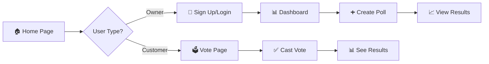
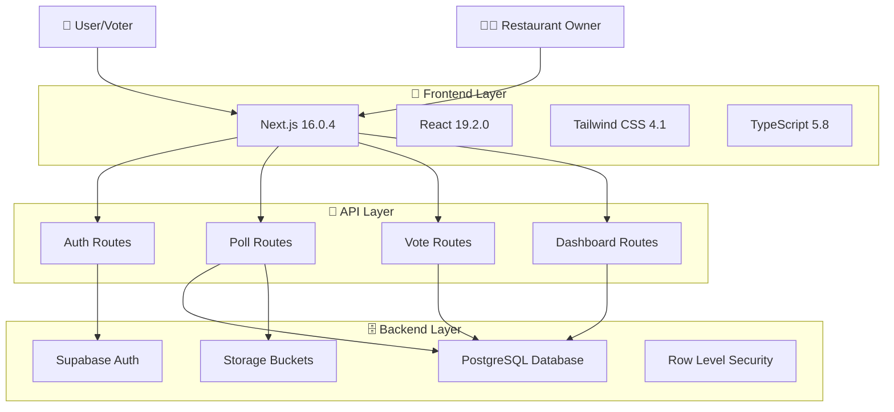
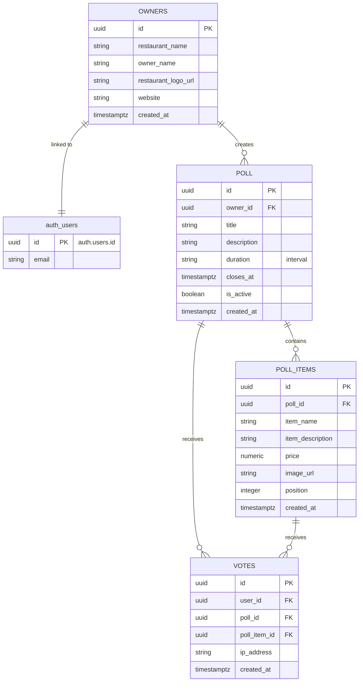
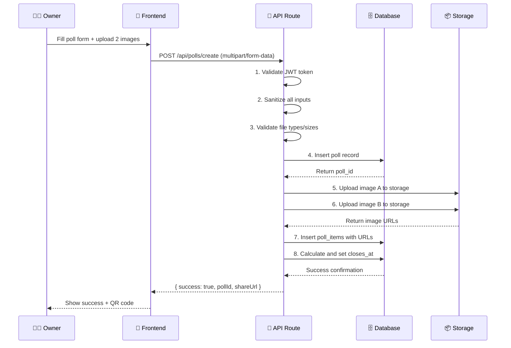
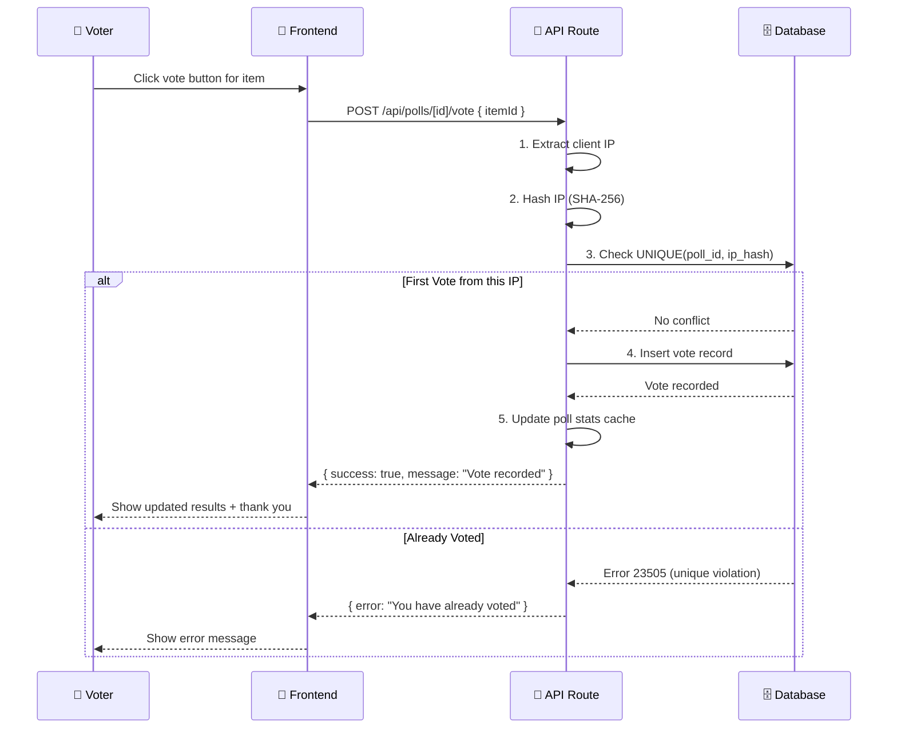
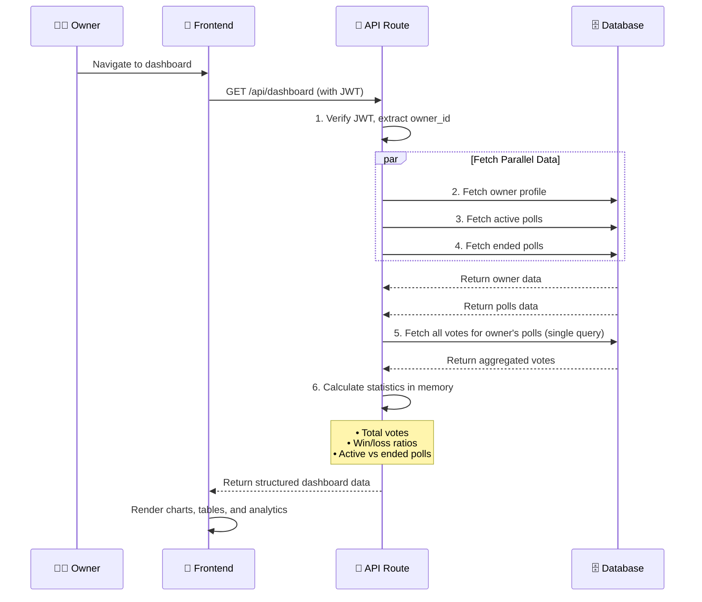

<div align="center">

# 🍽️ Menu Fight
### Data-Driven Menu Validation Platform

[](https://nextjs.org/)
[](https://www.typescriptlang.org/)
[](https://tailwindcss.com/)
[](https://supabase.com/)
[](https://vercel.com/)

> **Stop Guessing. Start Validating.**
>
> Menu Fight is the A/B testing platform for restaurants to predict dish success before launch.

[🚀 Live Demo](#-live-demo) • [📖 Documentation](#-overview) • [🛠️ Installation](#-installation-guide) • [🤝 Contributing](#-contributing)

</div>

---

## 📖 Table of Contents

- [📖 Overview](#-overview)
- [🧩 The Problem](#-the-problem)
- [💡 The Solution](#-the-solution)
- [💎 Value Proposition](#-value-proposition)
- [👥 Target Users](#-target-users--market-segments)
- [🛤️ User Journey](#%EF%B8%8F-user-journey)
- [🚀 Live Demo](#-live-demo)
- [✨ Feature Highlights](#-feature-highlights)
- [🔧 Functionalities](#-functionalities)
- [🏗️ System Architecture](#%EF%B8%8F-system-architecture)
- [💻 Tech Stack](#-tech-stack)
- [📂 Project Structure](#-project-structure)
- [🗄️ Database Schema](#%EF%B8%8F-database-schema)
- [🔌 API Documentation](#-api-documentation)
- [🔒 Security & Performance](#-security--performance)
- [📥 Installation Guide](#-installation-guide)
- [🌐 Deployment](#-deployment)
- [🛣️ Roadmap](#%EF%B8%8F-roadmap)
- [📝 License](#-license)

---

## 📖 Overview

Menu Fight is a modern web application designed to help restaurants, cloud kitchens, and food brands validate new menu items before investing in full-scale production. By leveraging A/B testing methodology, Menu Fight enables data-driven decision-making, reducing waste and increasing the success rate of new menu launches.

---

## 🧩 The Problem

*   🍽️ **Wasted Resources**: Restaurants invest thousands in launching dishes that customers don't want, resulting in financial losses.
*   ❌ **High Failure Rate**: Failed menu items lead to wasted ingredients, lost marketing budgets, and poor sales performance.
*   😕 **Lack of Validation**: There's no fast, reliable way to test new menu ideas before committing significant resources.
*   💬 **Opinion-Based Decisions**: Owners rely on gut feelings and small focus groups rather than real customer data at scale.
*   📉 **Risk Aversion**: Fear of failure prevents innovation and menu evolution.

> [!WARNING]
> **Real-world impact:**
> *   A single failed dish launch can cost **$500–$5000**.
> *   Restaurants need **fast, reliable data**, not guesses.

## 💡 The Solution

Menu Fight provides a complete **A/B testing system for menu items**:

1.  **Creation**: Chef uploads 2 dish concepts with photos and descriptions.
2.  **Distribution**: System generates a public shareable voting link.
3.  **Voting**: Customers vote without signup (IP-restricted).
4.  **Analysis**: Dashboard shows real-time results.
5.  **Decision**: Clear winner identified for confident launch.

## 💎 Value Proposition

| For Restaurant Owners | Benefit |
| :--- | :--- |
| ✔ **Predict Success** | Know which dishes will succeed before investing in inventory. |
| ✔ **Reduce Waste** | Eliminate the cost of failed menu items and wasted ingredients. |
| ✔ **Data-Driven** | Replace guesswork with real customer preferences. |
| ✔ **Faster Iterations** | Test multiple concepts quickly and iterate based on feedback. |
| ✔ **No Tech Skills** | Simple interface that anyone can use—no data team needed. |

---

## 👥 Target Users & Market Segments

| Segment | Needs & Characteristics |
| :--- | :--- |
| **🍔 Restaurants** | Frequent menu updates, seasonal item testing. |
| **☁️ Cloud Kitchens** | Constant experimentation, high dependency on data. |
| **🥡 Small Vendors** | Food trucks/cafés needing fast decisions on low budgets. |
| **🧪 R&D Teams** | Corporate chains testing prototypes before national rollout. |
| **📱 Influencer Brands** | Social media-driven brands needing fan validation. |

### Use Cases
*   **Seasonal Menu Planning**: Test summer vs. winter dish concepts.
*   **Price Point Validation**: Determine optimal pricing through feedback.
*   **Ingredient Substitution**: Test acceptance of ingredient changes.
*   **New Concept Testing**: Validate entirely new cuisine directions.

---

## 🛤️ User Journey

### Voting Process Flow



### For Restaurant Owners (The "Fighters")
1.  **Create Battle**: Log in, click "Create New Battle", upload 2 concepts.
2.  **Add Details**: Photos, descriptions, prices, and duration.
3.  **Launch**: Generate unique link and QR code.
4.  **Monitor**: Watch real-time analytic dashboard.
5.  **Decide**: Review final results and launch the winner.

### For Customers (The "Judges")
1.  **Access**: Click shared link (No Login Required).
2.  **View**: Compare side-by-side images and prices.
3.  **Vote**: One-tap voting with instant confirmation.
4.  **Results**: See live gamified results immediately.

---

## 🚀 Live Demo

**🌐 [View Live Application](https://menufight.vercel.app/)** *(Replace with your actual deployment URL)*

---

## ✨ Feature Highlights

### For Restaurant Owners

| Feature | Description | Benefit |
| --- | --- | --- |
| 🗳️ **Instant Poll Creation** | Create battles in under 2 minutes | Quick validation without technical barriers |
| 📊 **Real-Time Dashboard** | Live vote tracking with percentages | Make informed decisions as data comes in |
| 🎨 **Beautiful Poll Pages** | Modern, mobile-responsive voting interface | High engagement rates from customers |
| 🔗 **Shareable Links** | Unique URLs for each poll | Distribute across all marketing channels |
| 📈 **Analytics & Insights** | Vote trends, timing, and patterns | Understand customer behavior |
| 🗂️ **Poll Management** | View active and historical battles | Track all validation efforts in one place |
| ⏱️ **Flexible Duration** | Set custom battle timeframes | Control data collection period |
| 🖼️ **Image Upload** | Support for high-quality dish photos | Professional presentation |
| 🔒 **Private Dashboard** | Secure owner-only access | Protect business data |

### For Voters (Customers)

| Feature | Description | Benefit |
| --- | --- | --- |
| 🚫 **No Login Required** | Vote without creating account | Frictionless participation |
| ⚡ **One-Tap Voting** | Single click to cast vote | Quick and easy |
| 📱 **Mobile Optimized** | Perfect on any device | Vote anywhere, anytime |
| 🏆 **Live Results** | See voting trends in real-time | Engaging, gamified experience |
| 🔄 **Vote Protection** | One vote per person (IP-based) | Fair and accurate results |
| 🎨 **Visual Design** | Beautiful, intuitive interface | Enjoyable user experience |

---

## 🔧 Functionalities

*(Deep Technical Explanation)*

### **📥 Image Uploading**
- Client uploads → Supabase Storage
- Compression before uploading
- Only JPG/PNG allowed
- Max size enforced

### **📏 Form Validation (Zod + RHF)**
- Prevent bad inputs
- Prevent empty fields
- Enforce price & text limits

### **🔐 IP-Based Vote Protection**
- Server checks if IP already voted
- Logged inside `votes` table
- Prevents poll manipulation

### **📈 Analytics Aggregation**
- Supabase SQL
- Aggregated in real time
- Live UI rendering

### **🧹 Input Sanitization**
- HTML sanitization
- Prevent XSS & malicious uploads

### **🚦 Row-Level Security**
- Only poll owners can access creating/editing
- Public can vote but not modify polls
- Secure API endpoints

---

## 🏗️ System Architecture

### Architecture Overview



### 📁 Application Structure

```text
menufight/
┌─────────────────────────────────────────────────────────┐
│                    🎨 Next.js Frontend                  │
├─────────────────────────────────────────────────────────┤
│  ┌──────────┐  ┌──────────┐  ┌──────────┐  ┌─────────┐  │
│  │   🏠     │  │  📊     │  │   ➕     │  │   🗳️    │  │
│  │  Home    │  │ Dashboard│  │ Create   │  │  Vote   │  │
│  │  Page    │  │  Page    │  │  Poll    │  │  Page   │  │
│  └──────────┘  └──────────┘  └──────────┘  └─────────┘  │
└─────────────────────────────────────────────────────────┘
                           ⬇️ API Calls
┌─────────────────────────────────────────────────────────┐
│               🔌 Next.js API Routes (App Router)        │
├─────────────────────────────────────────────────────────┤
│  ┌──────────┐  ┌──────────┐  ┌──────────┐  ┌─────────┐  │
│  │  🔐      │  │  📊      │  │  🗳️      │  │  📈    │  │
│  │  Auth    │  │  Polls   │  │  Vote    │  │  Dashboard│ │
│  │  API     │  │  API     │  │  API     │  │  API     │ │
│  └──────────┘  └──────────┘  └──────────┘  └─────────┘  │
└─────────────────────────────────────────────────────────┘
                           ⬇️ Database Operations
┌─────────────────────────────────────────────────────────┐
│                   🗄️ Supabase Backend                   │
├─────────────────────────────────────────────────────────┤
│  ┌──────────┐  ┌──────────┐  ┌──────────┐  ┌─────────┐  │
│  │   🗃️     │  │   👤     │  │   📁     │  │   🔐    │  │
│  │ PostgreSQL│  │  Auth    │  │ Storage  │  │  RLS    │  │
│  │  Database │  │  System  │  │  Bucket  │  │ Policies│  │
│  └──────────┘  └──────────┘  └──────────┘  └─────────┘  │
└─────────────────────────────────────────────────────────┘
```

---

## 💻 Tech Stack

### Frontend
| Component | Technology | Version | Description |
| :--- | :--- | :--- | :--- |
| **Framework** | **Next.js** | 16.0.7 | App Router, Server Components. |
| **Library** | **React** | 19.2.0 | Concurrent features, optimized hydration. |
| **Language** | **TypeScript** | 5.8 | Static typing for safety. |
| **Styling** | **Tailwind CSS** | 4.1 | Utility-first styling engine. |
| **Processor**| **PostCSS** | 8.5 | Tool for transforming CSS with JavaScript. |

### Backend
| Component | Technology | Description |
| :--- | :--- | :--- |
| **Platform** | **Supabase** | Managed Backend-as-a-Service. |
| **Database** | **PostgreSQL** | Relational data with RLS policies. |
| **Auth** | **Supabase Auth** | JWT-based secure sessions. |
| **Storage** | **Supabase Storage** | CDN-backed image hosting. |

### Development Tools
-   **ESLint**: Code linting and quality checks.
-   **TypeScript**: Type checking and IntelliSense.
-   **Next.js Dev Server**: Hot module replacement and fast refresh.

### Deployment & Hosting
-   **Vercel**: Optimized hosting for Next.js with Edge Network and automatic SSL.

---

## 📂 Project Structure

```bash
menufight/
├── 📁 app/                    # Next.js App Router
│   ├── 📁 (auth)/            # Auth Routes (Login/Signup)
│   ├── 📁 actions/           # Server Actions
│   ├── 📁 api/               # API Routes (Auth, Polls, Vote)
│   ├── 📁 create-poll/       # Poll Creation Page
│   ├── 📁 dashboard/         # Protected Owner Dashboard
│   ├── 📁 poll/              # Public Voting Pages
│   └── layout.tsx            # Root Layout
├── 📁 components/            # React UI Components
│   ├── 📁 auth/              # Auth Components
│   ├── 📁 commons/           # Shared Components
│   ├── 📁 create-poll/       # Poll Forms
│   ├── 📁 dashboard/         # Dashboard Widgets
│   ├── 📁 forms/             # Reusable Form Elements
│   ├── 📁 home/              # Landing Page Sections
│   ├── 📁 results/           # Results Visualization
│   ├── 📁 ui/                # UI Primitives
│   └── 📁 vote/              # Voting Cards
├── 📁 config/                # App Configuration
├── 📁 documents/             # Project Documentation
├── 📁 lib/                   # Utilities & Logic
│   ├── 📁 middleware/        # Auth Middleware
│   ├── 📁 supabase/          # Supabase Clients
│   ├── 📁 utils/             # Helper Functions
│   ├── constants.ts          # App Constants
│   └── rateLimit.ts          # API Rate Limiter
├── 📁 public/                # Static Assets (Images)
├── 📁 styles/                # Global Styles
└── 📁 types/                 # TypeScript Definitions
```

---

## 🗄️ Database Schema

### 🔗 Entity Relationship Diagram (ERD)



### 🗃️ Table Summary

| Table | Key Columns | Relationships |
| :--- | :--- | :--- |
| **owners** | `id` (PK), `restaurant_name`, `restaurant_logo_url`, `website` | Linked to `auth.users.id` |
| **poll** | `id`, `owner_id` (FK), `closes_at`, `is_active`, `duration` | ← 1 owner → 2 items, many votes |
| **poll_items** | `id`, `poll_id` (FK), `price`, `image_url`, `position` | → Many votes |
| **votes** | `id` (PK), `poll_id`, `poll_item_id`, `ip_address` | Unique: `(poll_id, ip_address)` |

### 📦 Storage: `poll-images` Bucket
*   **Type**: Public
*   **Path**: `{poll_id}/{timestamp}-{A|B}.{ext}`
*   **Max**: 5MB
*   **Types**: JPEG, PNG, WebP, GIF

---

## 🔌 API Documentation

All API routes follow RESTful conventions and return JSON responses.

**Base URL**: `https://your-domain.com/api`

### 1. Poll Management

#### `POST /api/polls/create`
Create a new battle. **Auth Required**.

| Parameter | Type | Required | Description |
| :--- | :--- | :--- | :--- |
| `title` | string | Yes | Name of the battle. |
| `duration` | number | Yes | Hours until poll ends. |
| `item1_name` | string | Yes | Name of first dish. |
| `item1_image` | file | Yes | Image file (Max 5MB). |
| `item2_name` | string | Yes | Name of second dish. |
| `item2_image` | file | Yes | Image file (Max 5MB). |

#### `GET /api/polls/[id]`
Retrieve poll details. **Public**.

| Response Field | Type | Description |
| :--- | :--- | :--- |
| `id` | UUID | Poll Identifier. |
| `status` | string | 'active' or 'ended'. |
| `totalVotes` | number | Live vote count. |
| `items` | array | List of dishes with stats. |

### 2. Voting

#### `POST /api/polls/[id]/vote`
Cast a vote. **Public** (IP Restricted).

| Parameter | Type | Required | Description |
| :--- | :--- | :--- | :--- |
| `itemId` | UUID | Yes | ID of the selected dish. |

| Response Field | Type | Description |
| :--- | :--- | :--- |
| `success` | boolean | Confirmation status. |
| `message` | string | "Vote recorded successfully". |

> [!NOTE]
> Returns `403 Forbidden` if the IP address has already voted on this poll.

### 🔄 Detailed API Flows

#### 🆕 Creating a Poll (Owner)


#### 🗳️ Casting a Vote (Customer)


#### 📊 Loading Dashboard (Owner)


---

## 🔒 Security & Performance

### 🛡️ Security Layers

```text
┌─────────────────────────────────────────────────────────┐
│                   🌐 User Request                       │
└─────────────────────────────────────────────────────────┘
                            ↓
┌─────────────────────────────────────────────────────────┐
│  1️⃣  RATE LIMITING                                      │
│      ⏱️ Prevents abuse (10-500 req/hour)                 │
│         • Vote: 100/hr  • View: 500/hr                  │
└─────────────────────────────────────────────────────────┘
                            ↓
┌─────────────────────────────────────────────────────────┐
│  2️⃣  AUTHENTICATION                                     │
│      🔐 Supabase JWT verification                       │
│      🍪 Secure HTTP-only cookies                        │
└─────────────────────────────────────────────────────────┘
                            ↓
┌─────────────────────────────────────────────────────────┐
│  3️⃣  INPUT SANITIZATION                                │
│      🧹 Strip HTML tags, special chars                  │
│      📏 Validate data types & lengths                   │
└─────────────────────────────────────────────────────────┘
                            ↓
┌─────────────────────────────────────────────────────────┐
│  4️⃣  FILE VALIDATION                                   │
│      🖼️ Check file type (JPEG, PNG, WebP)               │
│      📦 Check file size (<5MB)                          │
│      🔍 Validate MIME type                              │
└─────────────────────────────────────────────────────────┘
                            ↓
┌─────────────────────────────────────────────────────────┐
│  5️⃣  ROW LEVEL SECURITY (RLS)                          │
│      🔒 Database-level access control                   │
│      ✅ ONLY owners can edit their polls                │
└─────────────────────────────────────────────────────────┘
                            ↓
┌─────────────────────────────────────────────────────────┐
│  6️⃣  UNIQUE CONSTRAINTS                                │
│      🚫 Prevent duplicate votes at DB level             │
│      ⚡ Atomic operations (poll_id, ip_address)         │
└─────────────────────────────────────────────────────────┘
```

---

## 📥 Installation Guide

### Prerequisites
*   Node.js v18+
*   Supabase Account

### Setup Steps

1.  **Clone Repository**
    ```bash
    git clone https://github.com/your-username/menufight.git
    cd menufight
    ```

2.  **Install Dependencies**
    ```bash
    npm install
    ```

3.  **Environment Setup**
    Create a `.env.local` file with your credentials:
    ```env
    NEXT_PUBLIC_SUPABASE_URL=https://your-project.supabase.co
    NEXT_PUBLIC_SUPABASE_ANON_KEY=your-anon-key
    ```

4.  **Run Development Server**
    ```bash
    npm run dev
    ```
    Visit `http://localhost:3000` to see the app.

---

## 🌐 Deployment

### Vercel (Recommended)

1.  Push code to GitHub.
2.  Import repository into Vercel.
3.  Add Environment Variables (`NEXT_PUBLIC_SUPABASE_URL`, etc).
4.  Click **Deploy**.

---

## 🛣️ Roadmap

### Phase 1: Core Features ✅ (Completed)
- ✅ User authentication (signup/login)
- ✅ Poll creation with two items
- ✅ Image upload and storage
- ✅ Public voting interface
- ✅ Real-time vote counting
- ✅ Owner dashboard
- ✅ Poll management (create, view, delete)
- ✅ Responsive design
- ✅ Security (RLS, rate limiting, sanitization)

### Phase 2: Enhanced Analytics 🚧 (In Progress)
- [ ]  **Advanced Dashboard Analytics**
    - Vote trends over time (hourly/daily charts)
    - Peak voting times analysis
    - Geographic distribution (if IP geolocation added)
    - Demographic insights (age, preferences)
- [ ]  **Export Functionality**
    - Download results as PDF
    - Export data as CSV for external analysis
    - Generate shareable reports
- [ ]  **Comparison Tools**
    - Compare multiple polls side-by-side
    - Historical performance tracking
    - Success rate metrics

### Phase 3: Social & Sharing 📅 (Planned)
- [ ]  **Enhanced Social Sharing**
    - Auto-generate social media cards (Open Graph)
    - Twitter/X card optimization
    - Instagram story templates
    - Facebook share previews
- [ ]  **QR Code Enhancements**
    - Customizable QR code designs
    - QR code with restaurant branding
    - Downloadable QR code posters
- [ ]  **Viral Features**
    - Share results after voting
    - "I voted" badges for social media
    - Leaderboard of most popular battles

### Phase 4: Advanced Features 🔮 (Future)
- [ ]  **Multi-Item Battles**
    - Support for 3-4 items per poll
    - Tournament-style brackets
    - Elimination rounds
- [ ]  **Comments & Feedback**
    - Allow voters to explain their choice
    - Qualitative feedback collection
    - Sentiment analysis on comments
- [ ]  **A/B Testing Variations**
    - Test different prices for same dish
    - Test different descriptions
    - Test different images
- [ ]  **Email Notifications**
    - Poll end notifications
    - Weekly summary emails
    - Milestone alerts (100 votes, etc.)
- [ ]  **Team Collaboration**
    - Multiple users per restaurant account
    - Role-based permissions (admin, viewer)
    - Shared dashboard access
- [ ]  **Mobile Apps**
    - Native iOS app
    - Native Android app
    - Push notifications

---

## 📝 License

This project is licensed under the **MIT License**.

**Made with ❤️ for the Food Industry**

[⬆ Back to Top](#%EF%B8%8F-menu-fight)


