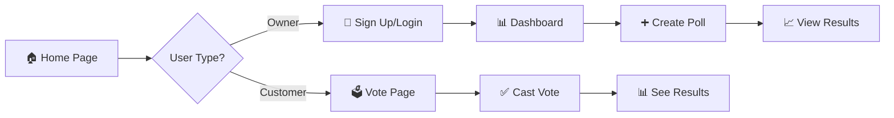
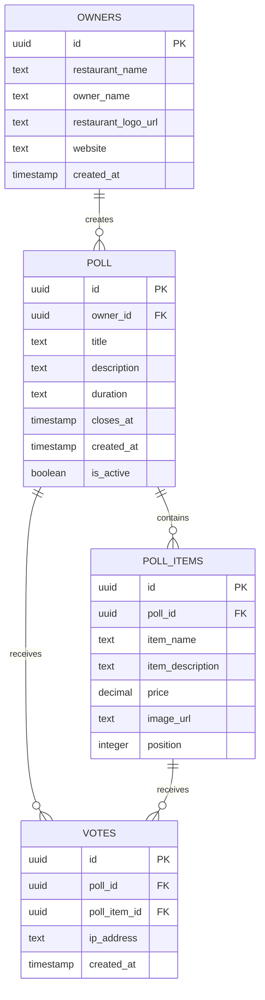
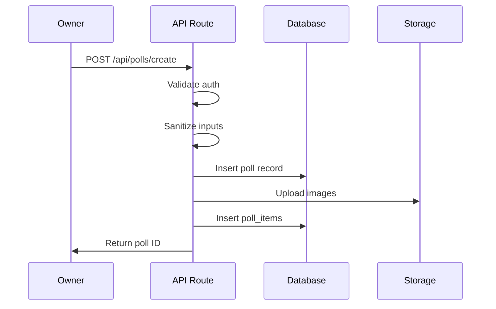
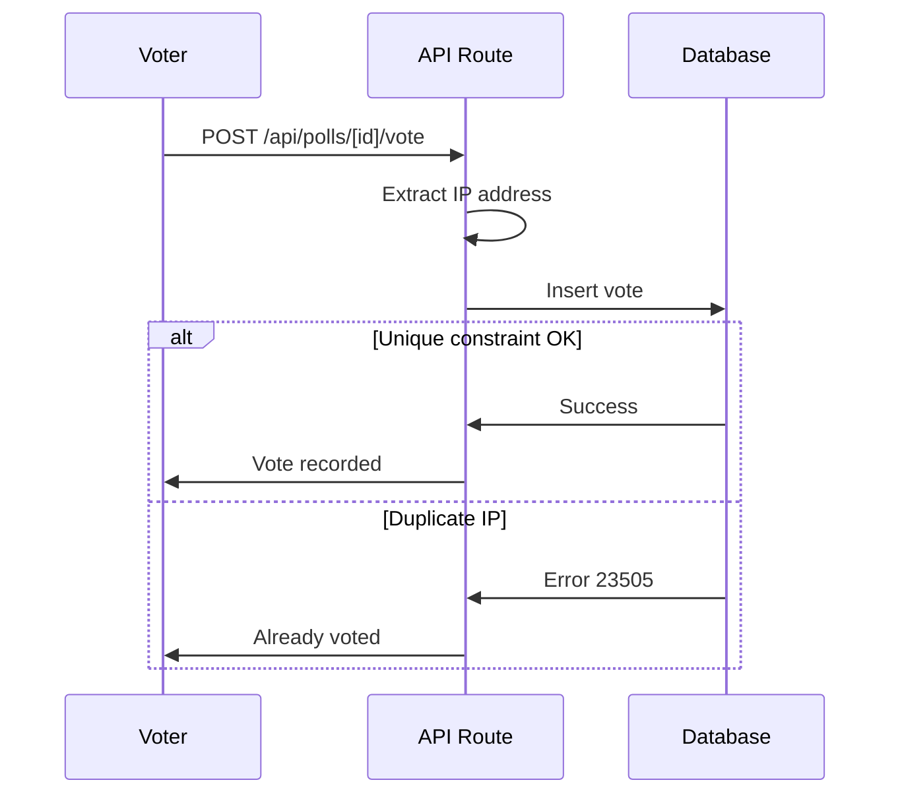
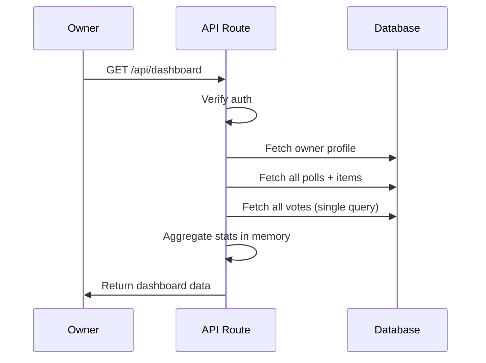

# MenuFight Platform - Executive Summary

> **A comprehensive overview of the MenuFight restaurant polling platform architecture, database design, and system components.**

---

## 📋 Table of Contents

1. [Platform Overview](#platform-overview)
2. [System Architecture](#system-architecture)
3. [Database Schema](#database-schema)
4. [API Architecture](#api-architecture)
5. [Security & Performance](#security--performance)
6. [Technology Stack](#technology-stack)

---

## 🎯 Platform Overview

**MenuFight** is a restaurant polling platform where restaurant owners create food item battles and customers vote on their favorites.

### Core Features

| Feature | Description | User Type |
|---------|-------------|-----------|
| 🏪 **Restaurant Profiles** | Create and manage restaurant accounts | Owners |
| ⚔️ **Food Battles** | Create polls with 2 competing menu items | Owners |
| 🗳️ **Public Voting** | Vote on favorite items (one vote per IP) | Customers |
| 📊 **Analytics Dashboard** | View poll results, vote counts, statistics | Owners |
| ⏱️ **Timed Polls** | Polls run for 24h, 48h, or 1 week | System |

### User Journey



---

## 🏗️ System Architecture

### Application Structure

```
┌─────────────────────────────────────────────────────────┐
│                    Next.js Frontend                      │
│  ┌──────────┐  ┌──────────┐  ┌──────────┐  ┌─────────┐ │
│  │   Home   │  │Dashboard │  │  Create  │  │  Vote   │ │
│  │   Page   │  │   Page   │  │   Poll   │  │  Page   │ │
│  └──────────┘  └──────────┘  └──────────┘  └─────────┘ │
└─────────────────────────────────────────────────────────┘
                          ↕️
┌─────────────────────────────────────────────────────────┐
│                   API Routes (Next.js)                   │
│  ┌──────────┐  ┌──────────┐  ┌──────────┐  ┌─────────┐ │
│  │   Auth   │  │  Polls   │  │   Vote   │  │Dashboard│ │
│  │  Signup  │  │  CRUD    │  │  System  │  │  Data   │ │
│  └──────────┘  └──────────┘  └──────────┘  └─────────┘ │
└─────────────────────────────────────────────────────────┘
                          ↕️
┌─────────────────────────────────────────────────────────┐
│                  Supabase Backend                        │
│  ┌──────────┐  ┌──────────┐  ┌──────────┐  ┌─────────┐ │
│  │PostgreSQL│  │   Auth   │  │ Storage  │  │   RLS   │ │
│  │ Database │  │  System  │  │  Bucket  │  │Policies │ │
│  └──────────┘  └──────────┘  └──────────┘  └─────────┘ │
└─────────────────────────────────────────────────────────┘
```

### Key Directories

| Directory | Purpose | Key Files |
|-----------|---------|-----------|
| 📁 **app/** | Next.js pages & API routes | `page.tsx`, `route.ts` |
| 📁 **components/** | React UI components | Dashboard, Forms, Vote UI |
| 📁 **lib/** | Utilities & helpers | Supabase clients, validation |
| 📁 **types/** | TypeScript definitions | Database types, API types |
| 📁 **documents/** | Documentation | This file! |

---

## 🗄️ Database Schema

### Entity Relationship Diagram



### Tables Overview

#### 1️⃣ **owners** - Restaurant Owner Profiles

| Column | Type | Purpose |
|--------|------|---------|
| `id` | UUID | User ID (synced with Supabase Auth) |
| `restaurant_name` | TEXT | Restaurant name |
| `owner_name` | TEXT | Owner display name |
| `restaurant_logo_url` | TEXT | Logo image URL |
| `website` | TEXT | Restaurant website |
| `created_at` | TIMESTAMP | Account creation time |

**Relationships:** One owner → Many polls

---

#### 2️⃣ **poll** - Food Battle Records

| Column | Type | Purpose |
|--------|------|---------|
| `id` | UUID | Poll identifier |
| `owner_id` | UUID | Creator (FK → owners) |
| `title` | TEXT | Poll title |
| `description` | TEXT | Poll question |
| `duration` | TEXT | '24h', '48h', or '1 Week' |
| `closes_at` | TIMESTAMP | Calculated closing time |
| `created_at` | TIMESTAMP | Creation time |
| `is_active` | BOOLEAN | Active status |

**Relationships:** 
- One poll → One owner
- One poll → Many items (2 items)
- One poll → Many votes

---

#### 3️⃣ **poll_items** - Food Items in Battles

| Column | Type | Purpose |
|--------|------|---------|
| `id` | UUID | Item identifier |
| `poll_id` | UUID | Parent poll (FK → poll) |
| `item_name` | TEXT | Food item name |
| `item_description` | TEXT | Item description |
| `price` | DECIMAL | Item price |
| `image_url` | TEXT | Image URL |
| `position` | INTEGER | Display order (1=A, 2=B) |

**Relationships:**
- One item → One poll
- One item → Many votes

---

#### 4️⃣ **votes** - Customer Votes

| Column | Type | Purpose |
|--------|------|---------|
| `id` | UUID | Vote identifier |
| `poll_id` | UUID | Poll reference (FK → poll) |
| `poll_item_id` | UUID | Voted item (FK → poll_items) |
| `ip_address` | TEXT | Voter IP (for deduplication) |
| `created_at` | TIMESTAMP | Vote timestamp |

**Unique Constraint:** `(poll_id, ip_address)` - One vote per IP per poll

**Relationships:**
- One vote → One poll
- One vote → One poll item

---

### 📦 Storage

#### **poll-images** Bucket

- **Type:** Public storage bucket
- **Purpose:** Store poll item images
- **Path Structure:** `{poll_id}/{timestamp}-{A|B}.{ext}`
- **Max Size:** 5MB per image
- **Allowed Types:** JPEG, PNG, WebP, GIF

**Example Path:**
```
poll-images/550e8400-e29b-41d4-a716-446655440000/1701234567890-A.jpg
```

---

## 🔌 API Architecture

### API Endpoints Overview

| Endpoint | Method | Purpose | Rate Limit |
|----------|--------|---------|------------|
| `/api/auth/signup` | POST | Create owner account | 3/hour |
| `/api/polls/create` | POST | Create new poll | 5/hour |
| `/api/polls/[id]` | GET | Fetch poll details | 100/hour |
| `/api/polls/[id]` | DELETE | Delete poll | Default |
| `/api/polls/[id]/vote` | POST | Cast vote | 10/hour |
| `/api/dashboard` | GET | Owner dashboard data | 60/hour |

### Data Flow Patterns

#### 🆕 Creating a Poll



#### 🗳️ Casting a Vote



#### 📊 Loading Dashboard



---

## 🔒 Security & Performance

### Security Measures

| Layer | Implementation | Purpose |
|-------|----------------|---------|
| 🛡️ **Authentication** | Supabase Auth | User identity management |
| 🔐 **Authorization** | Row Level Security (RLS) | Data access control |
| 🧹 **Input Sanitization** | `lib/sanitize.ts` | XSS prevention |
| 📁 **File Validation** | `lib/fileValidation.ts` | Secure uploads (5MB max) |
| ⏱️ **Rate Limiting** | `lib/middleware/rateLimit.ts` | Abuse prevention |
| 🍪 **Session Management** | `middleware.ts` | Auth cookie handling |

### Row Level Security (RLS) Policies

```
┌─────────────────────────────────────────────────────┐
│                  RLS Policy Matrix                   │
├─────────────┬──────────┬──────────┬──────────┬──────┤
│   Table     │  SELECT  │  INSERT  │  UPDATE  │DELETE│
├─────────────┼──────────┼──────────┼──────────┼──────┤
│ owners      │ Own only │ Service  │ Own only │  -   │
│ poll        │ Public   │ Auth'd   │ Own only │ Own  │
│ poll_items  │ Public   │ Via poll │    -     │ Via  │
│ votes       │ Public   │ Public   │    -     │  -   │
└─────────────┴──────────┴──────────┴──────────┴──────┘
```

### Performance Optimizations

| Optimization | Implementation | Impact |
|--------------|----------------|--------|
| 🚀 **Single Query Aggregation** | Fetch all votes at once | Eliminates N+1 queries |
| 📇 **Database Indexes** | 10+ indexes on FKs & queries | Fast lookups |
| 💾 **In-Memory Aggregation** | Calculate stats in code | Reduces DB load |
| ⚡ **Unique Constraints** | DB-level duplicate prevention | Atomic operations |
| 🗂️ **Caching Headers** | `Cache-Control` on polls | Reduced API calls |

---

## 💻 Technology Stack

### Frontend

| Technology | Version | Purpose |
|------------|---------|---------|
| ⚛️ **React** | 19.2.0 | UI framework |
| ▲ **Next.js** | 16.0.4 | Full-stack framework (App Router) |
| 🎨 **Tailwind CSS** | 4.1.17 | Styling |
| 📘 **TypeScript** | 5.8.2 | Type safety |

### Backend

| Technology | Version | Purpose |
|------------|---------|---------|
| 🐘 **PostgreSQL** | (Supabase) | Database |
| 🔐 **Supabase Auth** | 2.86.0 | Authentication |
| 📦 **Supabase Storage** | 2.86.0 | File storage |
| 🔒 **Supabase RLS** | (Built-in) | Authorization |

### Utilities

| Library | Purpose |
|---------|---------|
| `@supabase/ssr` | Server-side Supabase client |
| `clsx` + `tailwind-merge` | Conditional styling |
| `dotenv` | Environment variables |

---

## 📊 System Statistics

### Database Metrics

| Metric | Value |
|--------|-------|
| **Total Tables** | 4 |
| **Storage Buckets** | 1 |
| **Foreign Keys** | 4 |
| **Unique Constraints** | 1 |
| **Indexes** | 10+ |
| **RLS Policies** | 15+ |

### Application Metrics

| Metric | Value |
|--------|-------|
| **API Endpoints** | 6 |
| **Pages** | 4 |
| **Components** | 20+ |
| **Type Definitions** | 15+ |
| **Rate Limit Rules** | 6 |

---

## 🎯 Critical Information Summary

### ✅ What Makes This App Secure

1. **RLS Policies** - Database-level access control
2. **Input Sanitization** - All user input stripped of HTML/special chars
3. **Rate Limiting** - Prevents spam and abuse
4. **File Validation** - Only images, max 5MB
5. **Unique Constraints** - Prevents duplicate votes at DB level
6. **Service Role Key** - Used only server-side for owner creation

### ✅ What Makes This App Performant

1. **Single Query Aggregation** - Fetch all votes at once, aggregate in memory
2. **Database Indexes** - Fast lookups on foreign keys and common queries
3. **Caching** - Poll data cached with `Cache-Control` headers
4. **Optimized Queries** - Use `count('exact', { head: true })` for counts only
5. **No N+1 Queries** - Batch related data fetching

### ✅ What Makes This App Scalable

1. **Supabase Backend** - Managed PostgreSQL with auto-scaling
2. **Next.js App Router** - Server-side rendering and API routes
3. **Storage Bucket** - Separate image storage (not in DB)
4. **Stateless API** - No server-side sessions (JWT-based auth)
5. **Horizontal Scaling** - Can deploy multiple Next.js instances

---

## 🚀 Quick Start Reference

### Environment Variables Required

```env
NEXT_PUBLIC_SUPABASE_URL=your-project-url
NEXT_PUBLIC_SUPABASE_ANON_KEY=your-anon-key
SUPABASE_SERVICE_ROLE_KEY=your-service-role-key
```

### Database Setup

1. Run SQL setup script from `supabase-sql-schema.md`
2. Verify tables created
3. Check RLS policies enabled
4. Create `poll-images` storage bucket

### Development Commands

```bash
npm run dev      # Start development server
npm run build    # Build for production
npm run start    # Start production server
npm run lint     # Run linter
```

---

## 📚 Documentation Index

| Document | Purpose |
|----------|---------|
| **README.md** | Navigation & overview |
| **supabase-schema.md** | Database structure details |
| **supabase-sql-schema.md** | SQL setup scripts |
| **api-database-reference.md** | API endpoints & queries |
| **data-types.md** | TypeScript type definitions |
| **project-structure.md** | File hierarchy |
| **EXECUTIVE_SUMMARY.md** | This document |

---

**Last Updated:** December 4, 2025  
**Version:** 1.0  
**Platform:** MenuFight Restaurant Polling System
