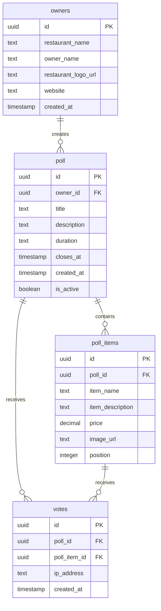

# MenuFight Supabase Database Schema

## Overview

This document outlines the complete database schema for the MenuFight platform, a restaurant polling application where restaurant owners can create food item battles and customers can vote on their favorites.

## Database Tables

### 1. `owners` Table

Restaurant owner profiles and authentication data.

**Columns:**

| Column Name | Type | Constraints | Description |
|------------|------|-------------|-------------|
| `id` | UUID | PRIMARY KEY | User ID from Supabase Auth (auth.users.id) |
| `restaurant_name` | TEXT | NOT NULL | Name of the restaurant |
| `owner_name` | TEXT | | Owner's display name (defaults to email prefix) |
| `restaurant_logo_url` | TEXT | | URL to restaurant logo image |
| `website` | TEXT | | Restaurant website URL |
| `created_at` | TIMESTAMP | NOT NULL | Account creation timestamp |

**Relationships:**
- One-to-Many with `poll` table (one owner can create multiple polls)

**Notes:**
- The `id` field is synchronized with Supabase Auth user IDs
- Created during signup via service role key to bypass RLS
- Used for restaurant branding on poll pages

---

### 2. `poll` Table

Main poll/battle records created by restaurant owners.

**Columns:**

| Column Name | Type | Constraints | Description |
|------------|------|-------------|-------------|
| `id` | UUID | PRIMARY KEY | Auto-generated poll identifier |
| `owner_id` | UUID | FOREIGN KEY → owners(id), NOT NULL | Reference to the owner who created the poll |
| `title` | TEXT | NOT NULL | Poll title (sanitized for XSS) |
| `description` | TEXT | | Poll question/description (sanitized) |
| `duration` | TEXT | NOT NULL | Duration option: '24h', '48h', or '1 Week' |
| `closes_at` | TIMESTAMP | NOT NULL | Calculated closing timestamp based on duration |
| `created_at` | TIMESTAMP | NOT NULL | Poll creation timestamp |
| `is_active` | BOOLEAN | DEFAULT true | Whether the poll is currently active |

**Relationships:**
- Many-to-One with `owners` table (each poll belongs to one owner)
- One-to-Many with `poll_items` table (each poll has multiple items)
- One-to-Many with `votes` table (each poll receives multiple votes)

**Business Logic:**
- `closes_at` is calculated from `created_at` + `duration`
- Active status determined by: `is_active = true AND closes_at > NOW()`
- Polls are soft-deleted (owner can delete their own polls)

---

### 3. `poll_items` Table

Individual food items/options within a poll (typically 2 items per poll).

**Columns:**

| Column Name | Type | Constraints | Description |
|------------|------|-------------|-------------|
| `id` | UUID | PRIMARY KEY | Auto-generated item identifier |
| `poll_id` | UUID | FOREIGN KEY → poll(id), NOT NULL | Reference to parent poll |
| `item_name` | TEXT | NOT NULL | Name of the food item (sanitized) |
| `item_description` | TEXT | | Description of the item (sanitized) |
| `price` | DECIMAL/FLOAT | | Item price (optional) |
| `image_url` | TEXT | NOT NULL | URL to item image (from storage or placeholder) |
| `position` | INTEGER | | Display order (1 or 2 for A/B items) |

**Relationships:**
- Many-to-One with `poll` table (each item belongs to one poll)
- One-to-Many with `votes` table (each item can receive multiple votes)

**Notes:**
- Images are uploaded to `poll-images` storage bucket
- Default placeholder: `https://via.placeholder.com/400?text=No+Image`
- Position field ensures consistent ordering (Item A = 1, Item B = 2)

**Cascade Behavior:**
- When a poll is deleted, all associated poll_items must be deleted first (manual cascade in code)

---

### 4. `votes` Table

Individual votes cast by users on poll items.

**Columns:**

| Column Name | Type | Constraints | Description |
|------------|------|-------------|-------------|
| `id` | UUID | PRIMARY KEY | Auto-generated vote identifier |
| `poll_id` | UUID | FOREIGN KEY → poll(id), NOT NULL | Reference to the poll |
| `poll_item_id` | UUID | FOREIGN KEY → poll_items(id), NOT NULL | Reference to the voted item |
| `ip_address` | TEXT | NOT NULL | Voter's IP address (for duplicate prevention) |
| `created_at` | TIMESTAMP | DEFAULT NOW() | Vote timestamp |

**Constraints:**
- **UNIQUE constraint** on `(poll_id, ip_address)` - prevents duplicate votes from same IP per poll
- Error code `23505` indicates duplicate vote attempt

**Relationships:**
- Many-to-One with `poll` table
- Many-to-One with `poll_items` table

**Business Logic:**
- One vote per IP address per poll (enforced at database level)
- IP address extracted from `x-real-ip` or `x-forwarded-for` headers
- Votes are aggregated for statistics (total votes, percentages)

**Cascade Behavior:**
- When poll_items are deleted, associated votes must be deleted first (manual cascade in code)

---

## Storage Buckets

### `poll-images` Bucket

Stores uploaded images for poll items.

**Configuration:**
- **Public Access:** Yes (images are publicly accessible via URL)
- **File Path Structure:** `{poll_id}/{timestamp}-{A|B}.{ext}`
  - Example: `550e8400-e29b-41d4-a716-446655440000/1701234567890-A.jpg`

**File Validation:**
- Allowed types: Images only (validated server-side)
- Filename sanitization applied to prevent path traversal
- File extension preserved from original upload

**Access Pattern:**
```javascript
const { data } = supabase.storage
  .from('poll-images')
  .getPublicUrl(filePath);
```

---

## Entity Relationship Diagram



---

## Row Level Security (RLS) Policies

> [!IMPORTANT]
> The application uses RLS policies to secure data access. Service role key is used during signup to bypass RLS for owner creation.

**Expected Policies:**

### `owners` Table
- **SELECT:** Users can read their own owner record (`auth.uid() = id`)
- **INSERT:** Service role only (handled via API route)
- **UPDATE:** Users can update their own owner record

### `poll` Table
- **SELECT:** Public read access (anyone can view polls)
- **INSERT:** Authenticated users only
- **UPDATE:** Owner only (`auth.uid() = owner_id`)
- **DELETE:** Owner only (`auth.uid() = owner_id`)

### `poll_items` Table
- **SELECT:** Public read access
- **INSERT:** Via poll owner (checked through poll relationship)
- **DELETE:** Via poll owner (checked through poll relationship)

### `votes` Table
- **SELECT:** Public read access (for vote counts)
- **INSERT:** Public (anyone can vote, duplicate prevention via unique constraint)

---

## Data Flow Examples

### Creating a Poll

1. **Authentication Check:** Verify user is logged in
2. **Insert Poll Record:** Create entry in `poll` table with owner_id
3. **Upload Images:** Upload item images to `poll-images` bucket
4. **Insert Poll Items:** Create 2 entries in `poll_items` table with image URLs
5. **Return Poll ID:** Return created poll ID to frontend

### Casting a Vote

1. **Extract IP Address:** Get voter's IP from request headers
2. **Insert Vote:** Attempt to insert into `votes` table
3. **Handle Duplicate:** If unique constraint violated (error 23505), return "already voted" error
4. **Success:** Return success response

### Loading Dashboard

1. **Authenticate User:** Verify user session
2. **Fetch Owner Data:** Get owner profile from `owners` table
3. **Fetch Polls:** Get all polls created by owner with items
4. **Aggregate Votes:** Fetch all votes for owner's polls in single query
5. **Calculate Stats:** Compute vote counts, percentages, unique IPs in memory
6. **Return Data:** Send formatted dashboard data to frontend

---

## Indexing Recommendations

For optimal performance, ensure the following indexes exist:

```sql
-- Foreign key indexes
CREATE INDEX idx_poll_owner_id ON poll(owner_id);
CREATE INDEX idx_poll_items_poll_id ON poll_items(poll_id);
CREATE INDEX idx_votes_poll_id ON votes(poll_id);
CREATE INDEX idx_votes_poll_item_id ON votes(poll_item_id);

-- Query optimization indexes
CREATE INDEX idx_poll_created_at ON poll(created_at DESC);
CREATE INDEX idx_poll_is_active ON poll(is_active);
CREATE INDEX idx_poll_closes_at ON poll(closes_at);

-- Unique constraint for vote deduplication
CREATE UNIQUE INDEX idx_votes_poll_ip ON votes(poll_id, ip_address);
```

---

## Data Sanitization

All user inputs are sanitized before database insertion to prevent XSS attacks:

- **Poll Title:** Max 100 chars, HTML stripped
- **Poll Description:** Max 500 chars, HTML stripped
- **Item Name:** Max 100 chars, HTML stripped
- **Item Description:** Max 300 chars, HTML stripped

Sanitization functions located in: `lib/sanitize.ts`

---

## Rate Limiting

API endpoints are rate-limited to prevent abuse:

| Endpoint | Limit | Window |
|----------|-------|--------|
| Poll Creation | 5 requests | 1 hour |
| Voting | 10 requests | 1 hour |
| Dashboard | 60 requests | 1 hour |
| Poll View | 100 requests | 1 hour |
| Signup | 3 requests | 1 hour |

Rate limiting implemented in: `lib/middleware/rateLimit.ts`
